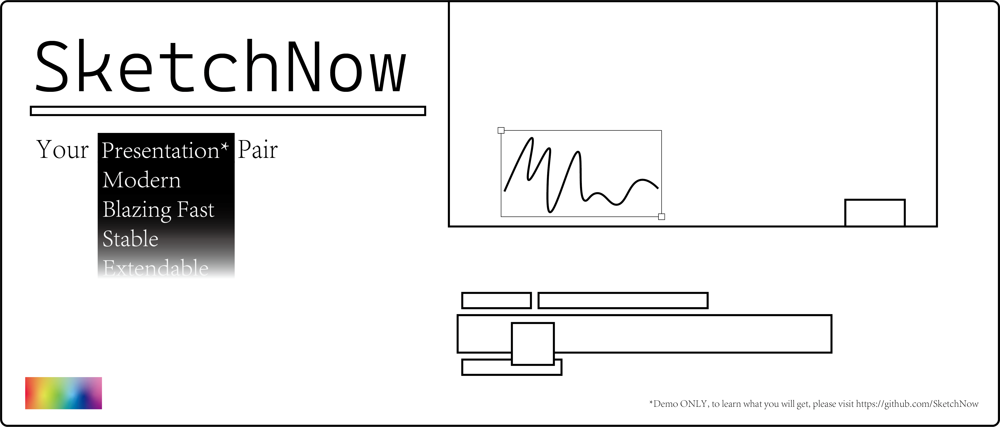

# SketchNow



[](https://github.com/SketchNow/SktechNow.WPF/issues)

An application brings the ability to draw on your screen(anywhere)
> [!CAUTION]
> Still developing. To avoid potential risks, please don't install in the production environment


### Install

Go [release](https://github.com/SketchNow/SketchNow.WPF/releases), and choose the version you want.

If you want to have a taste of the latest commited code,
you can go [actions](https://github.com/SketchNow/SketchNow.WPF/actions),
and download the `app` of all `artifacts`  

### Contribute
1. Follow the `.editorconfig`
2. Use `Xaml Styler` to format xaml (Xaml Styler file at [Settings.XamlStyler](Settings.XamlStyler))
3. Follow [`Conventional Commits`](https://www.conventionalcommits.org/en/v1.0.0/)
4. Follow [`Semantic Versioning`](https://semver.org/)
### Build
- Windows 10 or greater
- Visual Studio 2022/JetBrains Rider
- .NET Desktop workload with `.NET 9`
### Publish
We are using [Velopack](https://github.com/velopack/velopack) to generate release

Before you use the following commands,
please ensure that you have read [this](https://docs.velopack.io/getting-started/csharp)
```shell
dotnet publish -c Release --self-contained -r win-x64 -o .\publish
```
```shell
vpk pack -u SketchNow -v 1.0.0 -p .\publish -e SketchNow.exe
```
### Test
- Moq.AutoMocker
### Credit
- [DotnetTemplates](https://github.com/Keboo/DotnetTemplates)
- [wpf](https://github.com/dotnet/wpf)
- [CommunityToolkit MVVM](https://github.com/CommunityToolkit/dotnet)
- [Material Design in XAML](https://github.com/MaterialDesignInXAML/MaterialDesignInXamlToolkit)
- [ValueConverters.NET](https://github.com/thomasgalliker/ValueConverters.NET)
- [WPF.JoshSmith.Controls.DragCanvas](https://github.com/denxorz/WPF.JoshSmith.Controls.DragCanvas)
- [Velopack](https://github.com/velopack/velopack)
- Moq.AutoMocker
- System.Text.Json
- Microsoft.Extensions.Hosting
- Microsoft.Extensions.DependencyInjection